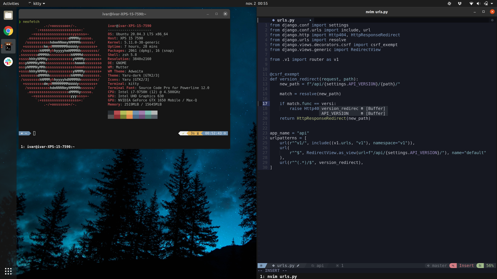

<h1 align="center" style="text-decoration: underline;">dotfiles</h1>

  

Dotfiles used on Ubuntu for the following:

- [neovim](https://neovim.io/)
- [zsh](http://zsh.sourceforge.net)
- [kitty](https://sw.kovidgoyal.net/kitty/)

